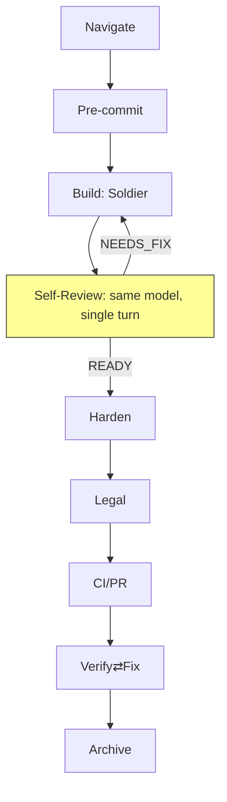

# HERO Pipeline Design

```
                              HERO PIPELINE FLOW
 ─────────────────────────────────────────────────────────────────────

                            [Planning Phases — Bypassable]
  Council → Research → PE ──[Proposal]──→ Communicator
       ┌─────────────────────────┤ approve? ├───────────────────────┐
       │  YES ──→ PE writes ──→ Architect ──→ Lead ──→ Soldiers    │
       │  NO  ──→ PE iterates or closes                            │
       └────────────────────────────────────────────────────────────┘
                                        │
                                        ▼
                          ┌─────────────────────────────────────────┐
                          │         EXECUTION LINE (Mandatory)       │
                          │                                         │
                          │  ┌───────────────────────────────────┐  │
                          │  │      ①  NAVIGATION               │  │
                          │  │  Archivist: graphify + hero map  │  │
                          │  │  → NAVIGATION_TREE.md            │  │
                          │  │  Lead reads it before spawning   │  │
                          │  │  Communicator checks on queries  │  │
                          │  └───────────────────────────────────┘  │
                          │            ↓                            │
                          │  ┌───────────────────────────────────┐  │
                          │  │      ②  PRE-COMMIT               │  │
                          │  │  Gitleaks · eslint · Copyright   │  │
                          │  └───────────────────────────────────┘  │
                          │            ↓                            │
                          │  ┌───────────────────────────────────┐  │
                          │  │      ③  BUILD                    │  │
                          │  │  Compile · Obfuscate · ProGuard  │  │
                          │  │  Auto-version                     │  │
                          │  └───────────────────────────────────┘  │
                          │            ↓                            │
                          │  ┌───────────────────────────────────┐  │
                          │  │   ③.5  SELF-REVIEW               │  │
                          │  │  Builder re-reads own diff        │  │
                          │  │  Verdict: READY / NEEDS_FIX       │  │
                          │  └───────────────────────────────────┘  │
                          │            ↓ (if READY)                 │
                          │  ┌───────────────────────────────────┐  │
                          │  │      ④  HARDEN                   │  │
                          │  │  Trivy · Semgrep · Root detect   │  │
                          │  │  Cert pinning                     │  │
                          │  └───────────────────────────────────┘  │
                          │            ↓                            │
                          │  ┌───────────────────────────────────┐  │
                          │  │      ⑤  LEGAL                    │  │
                          │  │  License scan · SBOM · EULA/PP   │  │
                          │  └───────────────────────────────────┘  │
                          │            ↓                            │
                          │  ┌───────────────────────────────────┐  │
                          │  │      ⑥  CI/PR                    │  │
                          │  │  Tests · Security scan · Verify  │  │
                          │  └───────────────────────────────────┘  │
                          │            ↓                            │
                          │  ┌───────────────────────────────────┐  │
                          │  │      ⑦  VERIFY                   │  │
                          │  │  Composite score ≥70 → proceed   │  │
                          │  │  Score <50 → FIX loop            │  │
                          │  └───────────────────────────────────┘  │
                          │            ↓                            │
                          │  ┌───────────────────────────────────┐  │
                          │  │      ⑧  ARCHIVE                  │  │
                          │  │  Store artifacts · SBOM · Journal │  │
                          │  │  Archivist Phase 3 (incl. Navig.) │  │
                          │  └───────────────────────────────────┘  │
                          └─────────────────────────────────────────┘
```

---

## Stage Details

| # | Stage | Tooling | Gate | Who Runs It |
|---|-------|---------|------|-------------|
| ① | **NAVIGATION** | `graphify --update` + `hero map` | NAVIGATION_TREE.md written | **Archivist** (sub-task) |
| ② | **PRE-COMMIT** | Gitleaks, eslint, copyright scan | No secrets, lint passes | Soldier |
| ③ | **BUILD** | npm build, flutter build, ProGuard | Binary compiles | Soldier |
| ③½ | **SELF-REVIEW** | Builder re-reads own diff vs task requirements | READY / NEEDS_FIX checklist | Same model (builder) |
| ④ | **HARDEN** | Trivy, Semgrep, root detect | No CRITICAL CVEs | Soldier |
| ⑤ | **LEGAL** | license-checker, SBOM, EULA | All licenses clear | Soldier |
| ⑥ | **CI/PR** | Tests, security scan, artifacts | All tests pass | Soldier |
| ⑦ | **VERIFY** | Composite score | Score ≥ 70 🟢 | Lead |
| ⑧ | **ARCHIVE** | Git, memory, artifact store | Logged + journaled | **Archivist** (Phase 3) |

## Mode Presets

| Mode | Stages | Use Case |
|------|--------|----------|
| `smart` (default) | All 8 stages + self-review | Full rebuild, auto-detect |
| `quick` | navigate + pre-commit + build + verify | Fast dev iteration |
| `ci` | pre-commit + build + cipr + verify | CI pipeline simulation |
| `audit` | harden + legal | Security/legal review |
| `full` | All 8 stages | Production deploy |

---

## Role Responsibilities (Navigation)

| Role | Responsibility | When |
|------|---------------|------|
| **Archivist** | Builds/updates `NAVIGATION_TREE.md` using graphify + hero map | After every work cycle (sub-task) + on-demand via `hero navigate` |
| **Lead** | Reads `NAVIGATION_TREE.md` before spawning soldiers. Includes relevant sections in soldier context payload | Before every spawn |
| **Communicator** | Checks `NAVIGATION_TREE.md` before answering project questions | On user inquiry about any project |

---

## The Navigation Cycle

```
 Work completes
     ↓
 Archivist runs graphify --update + hero map
     ↓
 Synthesizes both graphs → updates NAVIGATION_TREE.md
     ↓
 Next session starts
     ↓
 Lead reads navigation tree → spawns informed soldiers
 Communicator checks tree → answers user questions
     ↓
 Work completes → cycle repeats
```

---

## How to Run

```bash
# Full pipeline (default = smart mode: all 8 stages)
hero go --sandbox <name> --task "<desc>"

# Mode presets
hero go --sandbox <name> --task "<desc>" --mode quick   # navigate + pre-commit + build + verify
hero go --sandbox <name> --task "<desc>" --mode ci      # pre-commit + build + cipr + verify
hero go --sandbox <name> --task "<desc>" --mode audit   # harden + legal only
hero go --sandbox <name> --task "<desc>" --mode full    # all 8 stages

# Stage range (run a subset in order)
hero go --sandbox <name> --task "<desc>" --from navigate --to build

# Single stage
hero go --sandbox <name> --task "<desc>" --stage harden

# Rebuild navigation tree only
hero go --sandbox <name> --task "" --stage navigate

# Full pipeline with auto-execution
hero go --sandbox <name> --task "<desc>" --auto

# Skip verify gate (dev mode)
hero go --sandbox <name> --task "<desc>" --no-verify

# Skip archive phase
hero go --sandbox <name> --task "<desc>" --no-archive

# Skip self-review phase
hero go --sandbox <name> --task "<desc>" --no-self-review
# or
hero go --sandbox <name> --task "<desc>" --skip self_review
```

---

## Self-Review Stage (③½)

Self-review sits between BUILD and HARDEN. The same model that built the diff
takes one fresh turn to re-read its work against the original task.

**Purpose:** Catch scope creep, missing requirements, and style violations
before the more expensive multi-model VERIFY pass.

**Prompt template:** `~/.hero/prompts/phases/self-review.md`

**Procedure:**
1. Re-read the original task requirements line by line
2. Map each requirement to a file:line in the diff
3. Check against code-quality heuristics (`load_rule("code-quality")`)
4. Scan for debug prints, dead code, TODO/FIXME
5. Emit a structured checklist with binary verdict

**Verdict:**
| Result | Action |
|--------|--------|
| 🟢 READY | Proceed to HARDEN |
| 🔴 NEEDS_FIX | Loop back to BUILD with checklist as input |

**Pipeline flow:**



**Configuration:**
- Enabled by default in all modes (`smart`, `full`, `quick`, `ci`)
- Skip with `--skip self_review` or `--no-self-review`
- Not run in legacy verify⇄fix-only mode
- Same model as BUILD (default: soldier model from army.yaml)

---

## Scoring

| Score | Color | Action |
|-------|-------|--------|
| ≥ 70 | 🟢 PASS | Proceed to next stage |
| 50-69 | 🟡 WARN | Proceed with warning |
| < 50 | 🔴 FAIL | Block pipeline, re-queue fix |

**Navigation stage scoring:** Binary — tree exists & current = PASS. Missing or stale = WARN.

---

## Pipeline Config Locations

```
Pipeline definitions:   ~/.hero/PIPELINE.md
Army roles:             ~/.hero/army.yaml
Archivist prompts:      ~/.hero/prompts/phases/archivist-phase3.md
                        ~/Development/HERO/src/hero/prompts/defaults/roles/archivist.md
Navigation trees:       <project>/knowledge/NAVIGATION_TREE.md
```

---

> **Last updated:** 2026-06-09 · Stage ① (NAVIGATION) added as Archivist sub-task.
